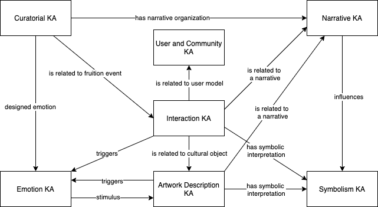

# SPICE Ontology Network

This repository contains the source code of the SPICE Ontology Network.


## Ontology Modules

Each directory contains an ontology module.
The name of the directory must correspond to the ID part of the  ontology IRI.
Therefore, the ontology IRI must comply with the following rule:

```
https://w3id.org/spice/SON/[Name of the folder]
```

Please use camel case for folder names.

The prefix of the ontology must be ``https://w3id.org/spice/SON/[Name of the folder]/`` (i.e. the IRI of the ontology followed by ``/``).

The file containing the ontology must be serialized in RDF/XML format and named ``ontology.owl``.

### Versioning

The SPICE ontology network is versioned, therefore the ontology modules must comply with the following rules.

1. Each ontology module *must declare* a version IRI and a prior version.

2. The version IRI *must comply* with the following rule:

```
https://w3id.org/spice/SON/[Name of the folder]/[version ID]
```
where ``version ID`` is the identifier of the version under development (currently, the stable version is the ``0.0.1``, the version under development is the ``0.0.2``).

3. Each ontology module *must import* the ontologies with the same version ID.

4. Version ID should follow [Semantic Versioning 2.0.0 Policy](https://semver.org/).

Releases will be taggeed with version IDs.
*Latest* release points to the latest *stable release* (it will not be updated at every ontology release).

## Ontology network backbone

The SPICE Ontology network uses [DOLCE+DnS Ultralite](http://www.ontologydesignpatterns.org/ont/dul/DUL.owl) and [D0](http://www.ontologydesignpatterns.org/ont/dul/d0.owl) as foundational backbone.


## Knowledge Areas Overview

A Knowledge Area is a collection of ontologies of the ontology network that share a common theme. Even if knowledge areas are not logical elements of the ontologies, they provide us a mean for classifying requirements and developed ontologies, drawing a thematic overview of the ontology network useful to analyse at a higher level the interactions between the ontologies.

The following Figure shows the Knowledge Areas of the SPICE Ontology Network (identified so far) and how they are interconnected. The knowledge areas were selected by analysing the user stories collected during the first year and related to the work carried out in all the work packages.




### Brand new ontologies

This is a list of the brand new ontologies developed for the SPICE project.

- [FULL](https://w3id.org/spice/SON/FULL) ``https://w3id.org/spice/SON/FULL`` is the catch-all that imports all the ontologies within the network.

- **Curatorial Knowledge Area**
  - [Curatorial Context](https://w3id.org/spice/SON/curatorialContext) ``https://w3id.org/spice/SON/curatorialContext`` provides a vocabulary for describing the curatorial context of any activity.
  - [Scripting](https://w3id.org/spice/SON/scripting) ``https://w3id.org/spice/SON/scripting`` allows us to describe aspects related to the design and execution of citizen curation activities, including engagement activities with museum visitors, web applications for eliciting users' interpretations (e.g., via storytelling, question answering), and social media interactions.

- **Narrative Knowledge Area**
  - [Narrative](https://w3id.org/spice/SON/NO) ``https://w3id.org/spice/SON/NO`` The Narrative Ontology (NO) is employed to describe both: 1) the narrative relations exhibited "within" a cultural entity (e.g. the representation of a certain action, story, character and their narrative connection, the narrative elements and that can be used to group similar museum items sharing exhibiting similar narrative content; 2) the narrative relations projected "about" a cultural entity and used to define narrative projects (this aspect representing "the complementary part" of the scripts).

- **Symbolism Knowledge Area**
  - Symbolism ontology *coming soon*

- **User and Community Knowledge Area**
  - [Schwartz Values](https://w3id.org/spice/SON/SchwartzValues) ``https://w3id.org/spice/SON/SchwartzValues`` is a formalization of the [Theory of Human Values](https://www.sciencedirect.com/science/article/pii/S2405844018372773)
  - [Haidt Values](https://w3id.org/spice/SON/HaidtValues) ``https://w3id.org/spice/SON/HaidtValues`` is a formalization of the  [Theory of Moral Foundation](https://psycnet.apa.org/doiLanding?doi=10.1037%2Fa0015141) proposed in the model by Haidt et al. 

- **Interaction Knowledge Area**
  - [Fruition context](https://w3id.org/spice/SON/fruitionContext) ``https://w3id.org/spice/SON/fruitionContext`` aims at representing the modality and the context of someone’s interaction with a cultural entity
  - [Affordance](https://w3id.org/spice/SON/affordance) ``https://w3id.org/spice/SON/affordance`` aims at formalising and generalising the [Gibson's theory of affordance](https://cs.brown.edu/courses/cs137/readings/Gibson-AFF.pdf).

- **Emotion Knowledge Area**
  - [Emotion](https://w3id.org/spice/SON/emotion) ``https://w3id.org/spice/SON/emotion`` is the closure module for the ontology network developed with the purpose to represent existing theories about Emotions, including the Emotion relation and its roles. 
  - [Emotion in cultural context](https://w3id.org/spice/SON/emotionInCulturalContext) ``https://w3id.org/spice/SON/emotionInCulturalContext``  specialises the Emotion module in order to represent the Emotion Relation triggered in a User or Community by some Cultural Entity. 
  - [Ekman emotions](https://w3id.org/spice/SON/ekmanEmotions) ``https://w3id.org/spice/SON/ekmanEmotions`` formalises the Ekman's theory on [Basic Emotions](https://www.paulekman.com/wp-content/uploads/2013/07/Basic-Emotions.pdf)
  - [Plutchik emotion](https://w3id.org/spice/SON/PlutchikEmotion) ``https://w3id.org/spice/SON/PlutchikEmotion`` formalises the [Pluchick's theory on Emotions](https://www.sciencedirect.com/science/article/pii/B9780125587013500077)
  - [OCC emotion](https://w3id.org/spice/SON/OCCEmotion) ``https://w3id.org/spice/SON/OCCEmotion`` formalises the [theory on Emotions proposed by Ortony, Clore and Collins](https://books.google.com/books?hl=it&lr=&id=dA3JEEAp6TsC&oi=fnd&pg=PP13&dq=ortony+clore+collins&ots=HXLvSq9Tma&sig=BaFT7kk6TMODde2UYC0BCOGCduQ)
  - [Shaver Emotions](https://w3id.org/spice/SON/ShaverEmotions) ``https://w3id.org/spice/SON/ShaverEmotions`` formalises the Shaver's theory on [emotions](https://psycnet.apa.org/buy/1987-28161-001).

**Artwork Description Knowledge Area**
  - [Exhibition](https://w3id.org/spice/SON/exhibition) ``https://w3id.org/spice/SON/exhibition`` defines a vocabulary for specifying information related fo cultural exhibitions.


### Existing ontologies re-used

The SPICE ontology network doesn't want to reinvent the wheel.
Lots of [awesome ontologies](Awesome_ontologies.md) are avaible at the state-of-the-art.
SON relies and possibly extends these ontologies.
Here, we provide a list of ontologies reused or recommended for the SPICE project together with a link to the issue where the need of the ontology emerged.
The issue discusses the requirement that motivates the use of the ontology and provides an example of use.

Linguistic data

- [semiotics](http://ontologydesignpatterns.org/cp/owl/semiotics.owl#) (cf. [#30](https://github.com/spice-h2020/SON/issues/30))
- [Earmark](http://www.essepuntato.it/2008/12/earmark#) (cf. [#30](https://github.com/spice-h2020/SON/issues/30))
- [POS](http://www.ontologydesignpatterns.org/ont/fred/pos.owl#) (cf. [#30](https://github.com/spice-h2020/SON/issues/30))

Artwork-related data

- [ArCo ontology network](https://w3id.org/arco/ontology/arco) (cf. [#31](https://github.com/spice-h2020/SON/issues/31))
- [CulturalON](http://dati.beniculturali.it/cis/) (cf. [#31](https://github.com/spice-h2020/SON/issues/31))
- [Getty vocabularies](http://vocab.getty.edu/) (cf. [#31](https://github.com/spice-h2020/SON/issues/31))
- [Building Topology Ontology (BOT)](https://w3id.org/bot#) (cf. [#31](https://github.com/spice-h2020/SON/issues/31)) (for describing the structure of the museums or the exhibitions)

### Testing protocol

SON Ontologies are continuosly tested. The testing protocol is described  [here](TESTING.md).

## How to contribute

You can contribute to the SPICE Ontology Network either by defining a new scenario (that can be submitted as [issues](https://github.com/spice-h2020/SON/issues/new/choose)) or  proposing an extension of the ontology.


## License

The content of this repository is distributed under [CC-BY 4.0](https://creativecommons.org/licenses/by/4.0/) license.
